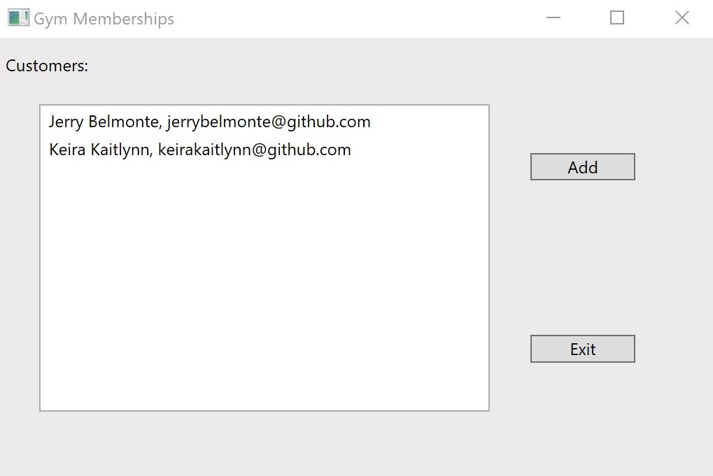
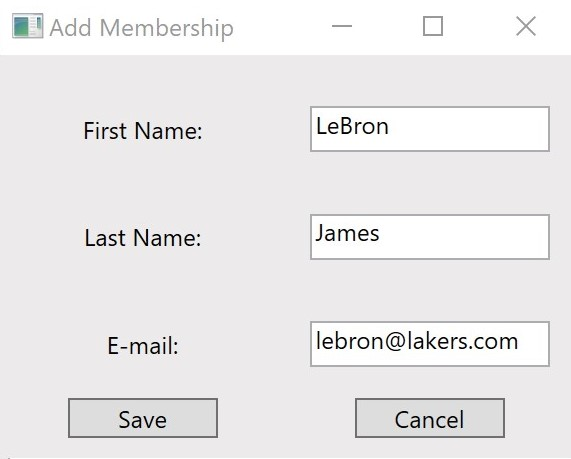
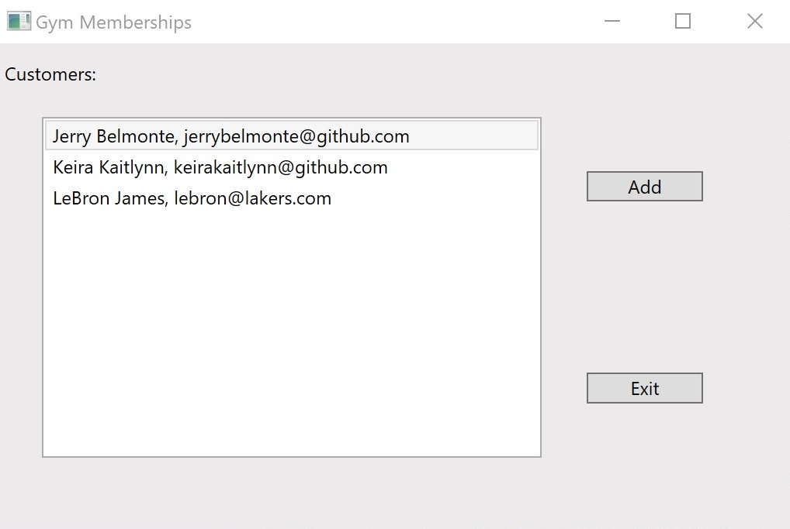
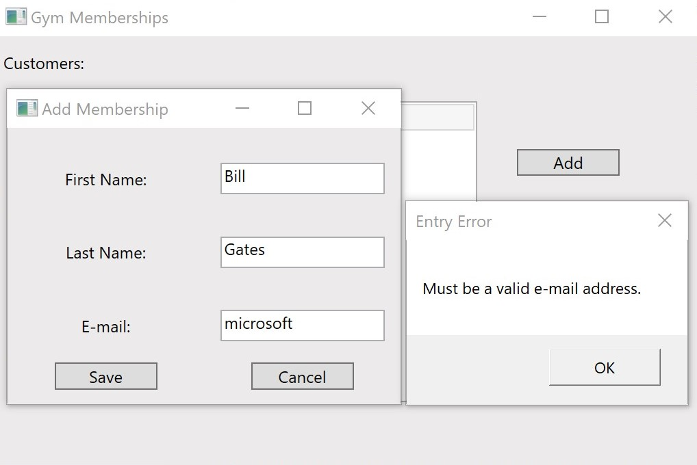
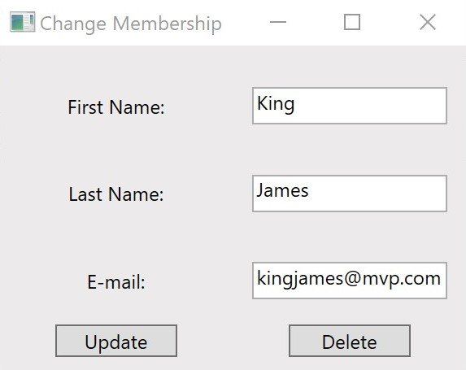
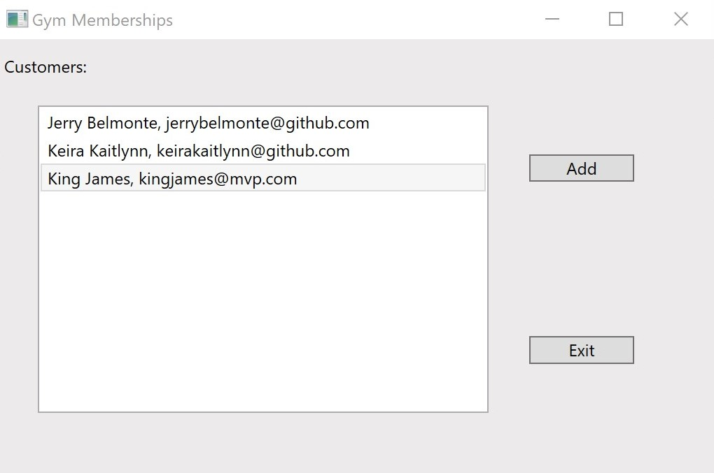
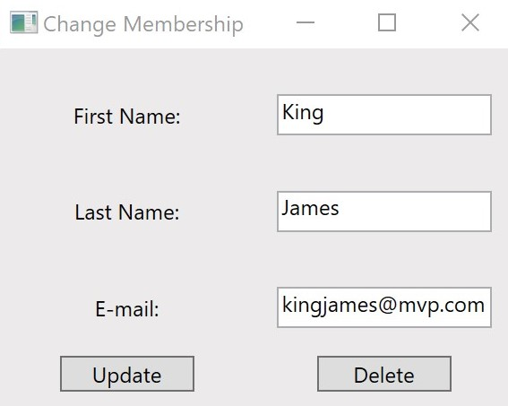
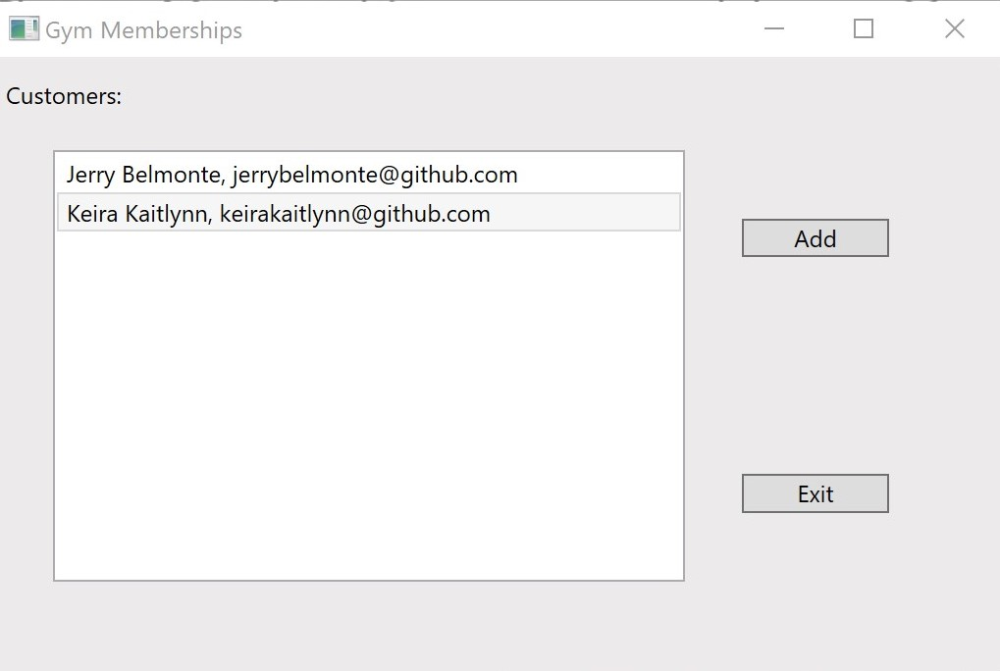

# Fitness Membership App
A Fitness Membership Maintenance CRUD Application.

## Table of Contents
- [Objective](#objective)
- [Introduction](#introduction)
- [Features](#features)
- [Technologies](#technologies)
- [How To Set Up](#how-to-set-up)
- [Authors](#authors)

## Objective
Create a desktop application for Windows using Microsoft's .NET Framework and the Model-View-ViewModel (MVVM) pattern.

## Introduction
- We designed a Fitness Membership Maintenance application that adds, updates and deletes memberships using Windows Presensation Foundation (WPF) and the MVVM light toolkit.
- We implemented all actions of adding, updating, and removing a membership.
- The add, update, and remove operations are updated to a text file.
- The application validates the user input before any write operations.

## Features

### The Membership Main View

### Add View

### Click Save

### Validation

### Update Membership

### Delete Membership

## Technologies
Project was created with:
- Visual Studio 2019 Version 16
- Microsoft .NET SDK
- .NET Framework 4.7.2
- Windows Presentation Foundation (WPF)
- MVVM Light Toolkit

## How To Set Up
To clone this GitHub repo and open this project, you will need **Git** and **Visual Studio 2019** installed on your computer:

1. Open Visual Studio 2019.
2. On the start window, select Clone a repository.
3. Enter or type the repository location, and then select Clone.
4. You might be asked for your user sign-in information in the Git User Information dialog box. You can either add your information or edit the default information it provides. Select Save to add the info to your global .gitconfig file. (Or, you can choose to do this later by selecting Cancel.) Next, Visual Studio automatically loads and opens the solution from the repository.
5. To start the program, press the green arrow (Start without debugging button) on the main Visual Studio toolbar, or press Ctrl+F5 to run the program. Visual Studio attempts to build the code in your project and run it. If that succeeds, great! But if not, click on the following link for [troubleshooting](https://docs.microsoft.com/en-us/visualstudio/get-started/csharp/run-program?view=vs-2019#troubleshooting)

Microsoft reference: [Open Project From GitHub Repo In Visual Studio](https://docs.microsoft.com/en-us/visualstudio/get-started/tutorial-open-project-from-repo-visual-studio-2019)

## Authors

* **Keira Kaitlynn** - https://github.com/keirakaitlynn
* **Jerry Belmonte** - https://github.com/jerrybelmonte
